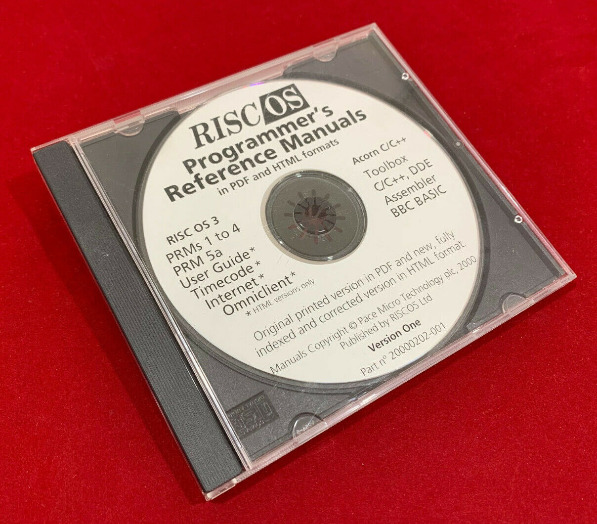

A Collection of Patches to the RISCOS Ltd Programmer's Reference Manuals CD
===========================================================================

**This repository contains a set of patch files which correct various defects in the _RISCOS Ltd. Programmer's Reference Manuals CD_.**

A PRMs CD reclines on red velour. Picture credit: C.J.E. Microcomputator's

Hey! An Old Man is Talking!
---------------------------
Way way back in the futuristic year 2000 I was responsible for producing the _RISCOS Ltd. Programmer's Reference Manuals CD_[^1]. It was intended to be an updated equivalent of [The Tekkie Disc](https://archive.org/details/the-tekkie-disc) from Emerald Publishing, which had needed its own special reader software[^2] to render its custom DrawFile-based file format. For the PRMs CD we would instead use HTML for the content.

We received the Framemaker source files from Pace Micro Technology[^3] and set about converting it to HTML. It wasn't easy. The HTML that emerged from our entirely legal _student edition_ of Framemaker was coated in a layer of machine-generated grot that not even liberal reapplications of HTMLTidy would save us from. I ended up fixing a *lot* of the HTML manually, mainly to keep the structure consistent from section to section.

Additionally, many of the diagrams were missing, having remained as references to files still living on Acorn's/Pace's network. I re-drew them all from scratch in Draw, obtaining any required screenshots by reconfiguring my machine to look like RISC OS 2, or 3, as required. I am amazing.

In order to keep the manual pages readable across the typical RISC OS browsers of the day: Fresco, Browse and - god forbid - Webster X fucking L, we had to resort to removing the ornate characters like double arrows and math symbols and replace them with small PNG equivalents. Here in the future, now that we live on the moon and wear silver jumpsuits, these can now be removed, and we can fix various other issues too.

Problems, Solutions
-------------------
* [X] Most of the HTML entities can now be replaced with UTF-8 codepoints, e.g. `&times;` can become `×`
* [X] All of the tiny PNG files are no longer required and look awkward, they should be expunged
* [ ] Some greedy regexps used in the original conversion have resulted in PORTIONS OF SHOUTY TEXT which need fixing

Patches
-------
Plainly, I can't distribute the contents of the original CD. The rights are now likely mired in the perpetual, energy draining and boring RISC OS ownership squabbles. So instead here is a bunch of patches to hopefully fix most of the major problems should you happen to own a copy of the disc, or y'know find it on the _internet_...

Related Projects
----------------
Gerph made PRMinXML which is the _correct_ way to handle this. http://gerph.org/riscos/ramble/documentation.html

---

[^1]: I wanted to call it _Programmer's Bookshelf_. I'd drawn a lovely picture of a book too.

[^2]: Which used to consume all of the RAM in your Arc, leaving no space for coding – useful!

[^3]: The then-owners of the RISC OS rights.
